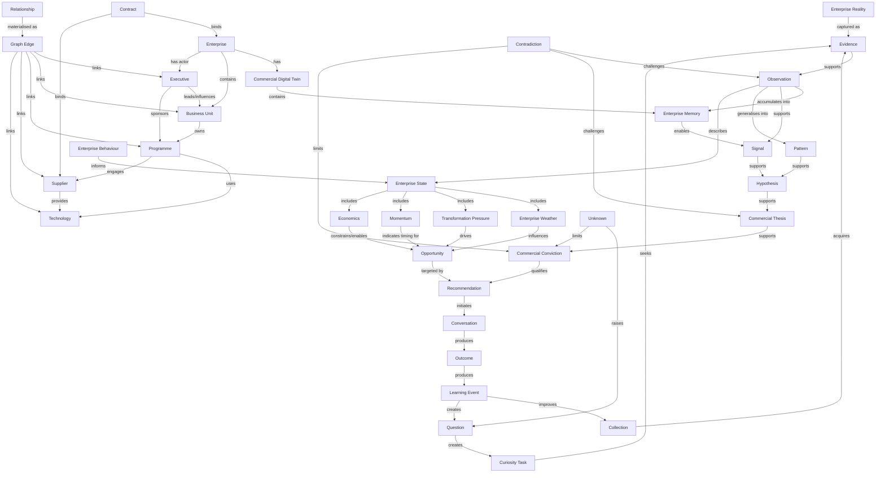

# RA-001 — CIOS Enterprise Intelligence Meta Model

**Status:** Draft
**Owner:** Rob / CIOS
**Last updated:** 2026-07-03
**Layer:** Meta Architecture
**Applies above:** Founding Papers, Enterprise Intelligence Papers, Reference Architecture, Runtime Architecture, Flora, Newton, Observatory, Publisher and future CIOS runtimes

## 0. Executive Summary

The CIOS Enterprise Intelligence Meta Model defines the conceptual language of CIOS. It identifies the architectural objects CIOS is allowed to create, ingest, infer, store, relate, promote, retire and learn from. It also defines the legal relationships between those objects.

The model exists so that every CIOS implementation shares one stable understanding of enterprise reality:

```text
Enterprise Reality
  ↓
Evidence
  ↓
Observation
  ↓
Enterprise Memory
  ↓
Commercial Reasoning
  ↓
Commercial Action
  ↓
Learning
```

RA-001 is not a database schema, ontology file, runtime API or application specification. It is the authoritative conceptual model that those downstream artefacts must conform to.

## 1. Purpose of the Meta Model

### 1.1 Why metamodels exist

A metamodel defines the permitted modelling language for an architecture. It answers questions such as:

- What kinds of things may exist in the architecture?
- What is each thing responsible for?
- Who owns it?
- How is it created, validated, persisted, superseded and retired?
- Which relationships are legal?
- Which derivations are allowed?
- Which evidence obligations must be satisfied before a claim becomes usable?

A metamodel sits above individual models. A model describes a specific enterprise, opportunity, executive, programme or recommendation. The metamodel describes the kinds of objects that make those models valid.

### 1.2 Why CIOS requires a metamodel

CIOS is an Enterprise Intelligence system. It does not merely store documents or generate summaries; it turns evidence into enterprise memory, commercial reasoning, recommendations, conversations, outcomes and learning. Without a metamodel, CIOS would risk mixing facts, interpretations, guesses, confidence, actions and outcomes into ambiguous records.

CIOS requires RA-001 because:

- evidence must remain distinguishable from interpretation;
- observations must remain distinguishable from hypotheses;
- conviction must remain distinguishable from certainty;
- recommendations must be traceable to reasoning and evidence;
- runtime implementations must not invent incompatible object types;
- learning must improve future collection and reasoning rather than disappear into unstructured notes;
- every enterprise model must be explainable, contestable and auditable.

### 1.3 Position in the architecture stack

RA-001 governs the conceptual layer above all other architecture documents:

```text
RA-001 Enterprise Intelligence Meta Model
  ↓ constrains
Reference Architecture
  ↓ organises
Founding Papers and Enterprise Intelligence Papers
  ↓ guide
Runtime Architecture
  ↓ implemented by
Flora, Newton, Observatory, Publisher and future products
```

Where another document defines a domain-specific standard, RA-001 defines the object class that standard operates on. Where runtime code creates data structures, RA-001 defines whether those structures are architecturally legal.

## 2. Architectural Philosophy

CIOS is grounded in the principle that commercial intelligence must preserve the journey from external reality to enterprise learning.

### 2.1 Enterprise Reality

Enterprise Reality is the actual state of an organisation and its environment. It includes assets, executives, suppliers, technologies, contracts, budgets, behaviours, constraints, opportunities, intent, pressure and market context. CIOS never has perfect access to Enterprise Reality; it only has evidence about it.

### 2.2 Evidence

Evidence is the captured trace of Enterprise Reality. Evidence may be a public filing, procurement notice, executive statement, job advert, architecture document, meeting note, article, observable product change, financial disclosure or other governed source material.

Evidence is not yet intelligence. It becomes intelligence only when interpreted into observations under evidence quality rules.

### 2.3 Observation

An Observation is a disciplined statement derived from evidence. It records what CIOS believes can reasonably be observed, when it was observed, from which evidence, and with what confidence and limitations.

### 2.4 Enterprise Memory

Enterprise Memory is the accumulated, time-aware store of observations, relationships, states, patterns and prior outcomes about an enterprise. It is not a static profile; it is a living representation of how the enterprise behaves and changes.

### 2.5 Commercial Reasoning

Commercial Reasoning turns memory into signals, patterns, hypotheses, theses, conviction and recommendations. It asks what the observed reality means commercially, what might happen next, where opportunity exists, who owns change, and what action is justified.

### 2.6 Commercial Action

Commercial Action is the governed move from recommendation into conversation, pursuit, proposal, intervention, partnership or decision. CIOS treats action as an architectural object because actions create outcomes that must be learned from.

### 2.7 Learning

Learning closes the loop. Outcomes test the quality of evidence, observations, hypotheses, theses, recommendations and conversations. Learning improves collection priorities, source quality, reasoning thresholds, pattern libraries and future recommendations.

## 3. First-Class Objects

Every object below is a first-class architectural object. Runtime implementations may use different physical representations, but they must preserve these semantics.

### 3.1 Object catalogue

| Object | Purpose | Owner | Lifecycle | Relationships | Persistence | Evidence requirements |
| --- | --- | --- | --- | --- | --- | --- |
| Enterprise | Represents a target organisation as a commercial-intelligence subject. | Enterprise Model Owner | Identified → profiled → monitored → enriched → archived. | Owns Digital Twin, State, Behaviour, Weather, Economics, Opportunities, Conversations. | Durable. | Must be anchored to authoritative identity evidence. |
| Commercial Digital Twin | Time-aware model of an Enterprise for reasoning and action. | Enterprise Intelligence Architecture | Initiated → populated → reasoned over → refreshed → versioned. | Composes Evidence, Observations, Relationships, States, Patterns and Opportunities. | Durable and versioned. | Every asserted component must trace to evidence or governed inference. |
| Evidence | Captured source material or source-derived artefact. | Collection Owner | Acquired → classified → quality-scored → accepted/rejected → refreshed/retired. | Supports Observations; challenges Contradictions; answers Questions. | Immutable or append-only. | Must include source, timestamp, provenance, quality and access context. |
| Observation | Atomic interpreted statement about an enterprise. | Intelligence Analyst or Reasoning Service | Proposed → validated → active → superseded/retracted/expired. | Supported by Evidence; supports Signals, Patterns, States and Hypotheses. | Durable with validity interval. | Requires one or more evidence references or explicit inference basis. |
| Signal | Meaningful indicator that something commercially relevant may be happening. | Signal Owner | Detected → qualified → monitored → promoted/dismissed/expired. | Supported by Observations; supports Hypotheses and Recommendations. | Durable while active; retained historically. | Requires observation lineage and signal rationale. |
| Pattern | Reusable structure detected across observations, enterprises or time. | Pattern Library Owner | Proposed → tested → accepted → reused → revised/retired. | Generalises Observations and Signals; supports Hypotheses and Forecasts. | Durable and versioned. | Requires examples, counterexamples and confidence basis. |
| Hypothesis | Testable proposition about enterprise reality or future behaviour. | Hypothesis Owner | Formed → tested → supported/refuted/inconclusive → learned from. | Supported by Signals and Patterns; supports Commercial Theses. | Durable, including rejected hypotheses. | Requires test plan, evidence need and validation outcome. |
| Commercial Thesis | Coherent commercial interpretation of an enterprise situation. | Commercial Reasoning Owner | Drafted → challenged → strengthened/weakened → accepted/retired. | Supported by Hypotheses; supports Conviction and Recommendations. | Durable and versioned. | Requires evidence-backed reasoning chain. |
| Commercial Conviction | Confidence that a thesis justifies commercial action. | Conviction Owner | Calculated → reviewed → thresholded → decayed/recalibrated. | Evaluates Thesis; qualifies Recommendation. | Durable as decision record. | Requires lineage, confidence rationale and uncertainty statement. |
| Recommendation | Proposed commercial action. | Recommendation Owner | Generated → reviewed → approved/rejected → acted/expired. | Supported by Thesis and Conviction; initiates Conversations. | Durable with decision status. | Requires action rationale, expected outcome and evidence lineage. |
| Executive | Human actor with influence, accountability or decision rights. | Executive Intelligence Owner | Identified → profiled → related → monitored → archived. | Belongs to Enterprise; owns or influences Units, Programmes, Contracts, Technologies and Conversations. | Durable and temporal. | Requires identity, role and relationship evidence. |
| Business Unit | Organisational subdivision with objectives, budget, capabilities or constraints. | Enterprise Model Owner | Identified → modelled → related → monitored → archived. | Part of Enterprise; owns Programmes, Technologies, Suppliers and Outcomes. | Durable and temporal. | Requires organisational evidence or validated inference. |
| Programme | Organised change initiative. | Transformation Intelligence Owner | Detected → scoped → tracked → completed/paused/cancelled. | Owned by Executives or Units; uses Suppliers, Contracts and Technology. | Durable and temporal. | Requires evidence of initiative, intent, investment or delivery activity. |
| Supplier | External provider relevant to enterprise capability or transformation. | Ecosystem Intelligence Owner | Identified → qualified → related → monitored → retired. | Connected to Contracts, Programmes, Technologies and Outcomes. | Durable and temporal. | Requires evidence of commercial or operational relationship. |
| Contract | Commercial agreement, framework, procurement or obligation. | Commercial Intelligence Owner | Detected → interpreted → active → renewed/expired/terminated. | Connects Enterprise, Supplier, Unit, Programme and Technology. | Durable and temporal. | Requires procurement, filing, disclosure or validated contract evidence. |
| Technology | Platform, system, architecture component, vendor product or capability. | Technology Intelligence Owner | Identified → classified → adopted → integrated → replaced/retired. | Used by Units and Programmes; supplied by Suppliers; affects State and Behaviour. | Durable and temporal. | Requires evidence of adoption, intent, usage or dependency. |
| Relationship | Typed association between two first-class objects. | Knowledge Graph Owner | Proposed → validated → active → superseded/retracted/expired. | Materialised as Graph Edges. | Durable and temporal. | Requires evidence or governed inference. |
| Graph Edge | Implementable representation of a Relationship in a graph. | Knowledge Graph Owner | Created → weighted → traversed → updated → retired. | Links nodes; carries type, direction, weight, time and provenance. | Durable and queryable. | Must trace to Relationship evidence or inference. |
| Enterprise State | Snapshot or interval description of enterprise condition. | State Model Owner | Observed → composed → evaluated → transitioned → archived. | Summarises Weather, Pressure, Momentum, Economics and Readiness. | Durable and versioned. | Requires supporting observations and state derivation rules. |
| Enterprise Behaviour | Repeated or characteristic way the enterprise acts. | Behaviour Model Owner | Detected → classified → monitored → revised. | Derived from Observations, Patterns and Outcomes. | Durable and temporal. | Requires behaviour examples across time. |
| Enterprise Weather | Current operating conditions affecting change. | Dynamics Owner | Measured → updated → forecast → expired. | Contributes to State, Pressure, Momentum and Opportunity. | Temporal snapshot series. | Requires recent evidence and freshness rules. |
| Transformation Pressure | Force increasing likelihood or urgency of change. | Transformation Intelligence Owner | Detected → quantified → monitored → relieved/escalated/expired. | Influences Momentum, Readiness, Hypotheses and Opportunities. | Temporal. | Requires internal or external pressure evidence. |
| Momentum | Direction and velocity of enterprise change. | Dynamics Owner | Estimated → monitored → accelerated/decelerated/reversed. | Derived from Programmes, Pressure, Weather and Outcomes. | Temporal. | Requires time-series observations. |
| Economics | Financial and commercial constraints, incentives and value pools. | Economics Owner | Profiled → analysed → updated → reforecast. | Influences Opportunity, Readiness, Conviction and Recommendation. | Durable and temporal. | Requires financial, procurement or validated economic evidence. |
| Opportunity | Potential commercial value/action space. | Opportunity Owner | Detected → qualified → shaped → pursued/won/lost/retired. | Supported by Thesis and Conviction; related to Executives, Units, Programmes and Technologies. | Durable and temporal. | Requires evidence-backed commercial rationale. |
| Conversation | Human or system-mediated commercial interaction. | Conversation Owner | Initiated → conducted → captured → followed up → closed. | Initiated by Recommendation; produces Outcomes and Evidence. | Durable with consent and governance constraints. | Requires participants, purpose, timestamp and summary/provenance. |
| Outcome | Result of action, conversation, recommendation or enterprise event. | Learning Owner | Captured → classified → evaluated → learned from. | Produced by Conversations or external events; produces Learning Events. | Durable. | Requires outcome evidence or explicit human attestation. |
| Learning Event | Structured update caused by an Outcome or validation result. | Learning Owner | Detected → interpreted → applied → monitored. | Improves Collection, Patterns, Reasoning and Recommendation thresholds. | Durable and auditable. | Requires trigger outcome and applied change rationale. |
| Question | Structured information need. | Curiosity Owner | Raised → prioritised → assigned → answered/closed/deferred. | Seeks Evidence; targets Unknowns and Contradictions. | Durable while relevant; retained historically. | Must state why answer matters and what would satisfy it. |
| Unknown | Explicitly modelled missing knowledge. | Curiosity Owner | Identified → scoped → prioritised → reduced/resolved/accepted. | Generates Questions and Curiosity Tasks; qualifies Conviction. | Durable until resolved or accepted. | Requires known context and missing element definition. |
| Contradiction | Conflict between evidence, observations or model state. | Quality Owner | Detected → triaged → investigated → resolved/escalated. | Challenges Observations, States, Theses and Recommendations. | Durable and auditable. | Requires conflicting claims and source lineage. |
| Curiosity Task | Directed collection or reasoning task to reduce uncertainty. | Collection or Reasoning Owner | Created → assigned → executed → completed/cancelled/learned from. | Generated by Questions, Unknowns, Contradictions and Learning Events. | Durable operational record. | Requires objective, target object and success criterion. |

## 4. Legal Relationships

Relationships must be typed, directional where meaningful, temporal and evidence-aware.

### 4.1 Core reasoning chain

```text
Evidence supports Observation
Observation supports Signal
Signal supports Hypothesis
Hypothesis supports Commercial Thesis
Commercial Thesis supports Commercial Conviction
Commercial Conviction qualifies Recommendation
Recommendation initiates Conversation
Conversation produces Outcome
Outcome produces Learning Event
Learning Event improves Collection
```

### 4.2 Enterprise modelling relationships

- Enterprise has Commercial Digital Twin.
- Enterprise contains Business Unit.
- Enterprise employs or is represented by Executive.
- Executive leads Business Unit.
- Executive sponsors Programme.
- Business Unit owns Programme.
- Programme uses Technology.
- Programme engages Supplier.
- Supplier provides Technology.
- Contract binds Enterprise and Supplier.
- Contract funds or constrains Programme.
- Technology enables or constrains Enterprise Behaviour.
- Relationship is represented by Graph Edge.

### 4.3 Dynamics relationships

- Observation describes Enterprise State.
- Enterprise Weather influences Enterprise State.
- Transformation Pressure changes Enterprise State.
- Momentum describes state transition direction and velocity.
- Economics constrains or enables Opportunity.
- Enterprise Behaviour predicts likely State Transition.
- Pattern generalises repeated Behaviour.

### 4.4 Uncertainty and curiosity relationships

- Unknown limits Commercial Conviction.
- Unknown generates Question.
- Question creates Curiosity Task.
- Curiosity Task seeks Evidence.
- Evidence answers Question.
- Evidence may resolve Unknown.
- Contradiction challenges Observation.
- Contradiction may weaken Hypothesis, Thesis, Conviction or Recommendation.

### 4.5 Commercial action relationships

- Opportunity is supported by Commercial Thesis.
- Opportunity is owned by Business Unit or Executive where ownership is known.
- Recommendation targets Opportunity.
- Recommendation identifies Executive or Business Unit audience.
- Conversation tests Recommendation.
- Outcome validates, weakens or refutes Recommendation.
- Learning Event recalibrates future Recommendations.

### 4.6 Prohibited relationships

The following are architecturally illegal unless mediated by the required intermediate object:

- Evidence directly creates Recommendation without Observation and reasoning lineage.
- Signal directly asserts Outcome without action or external event evidence.
- Hypothesis is treated as Enterprise State without validation.
- Commercial Conviction is treated as certainty.
- Conversation overwrites Evidence lineage.
- Learning changes collection or reasoning thresholds without a Learning Event.
- Runtime state becomes authoritative architecture without conformance to RA-001.

## 5. Inheritance

Inheritance defines specialised object types that preserve the parent object's obligations while adding domain-specific semantics.

### 5.1 Inheritance rule

A child object inherits:

- identity requirements;
- lifecycle obligations;
- evidence lineage obligations;
- temporal validity obligations;
- relationship rules;
- persistence expectations;
- auditability requirements.

A child object may add fields, constraints, scoring rules and specialised relationships. It may not remove parent obligations.

### 5.2 Observation inheritance

```text
Observation
  ├─ Executive Observation
  ├─ Financial Observation
  ├─ Technology Observation
  ├─ Relationship Observation
  ├─ Programme Observation
  ├─ Supplier Observation
  ├─ Contract Observation
  ├─ Behaviour Observation
  ├─ Weather Observation
  ├─ Pressure Observation
  ├─ Momentum Observation
  └─ Outcome Observation
```

### 5.3 Evidence inheritance

```text
Evidence
  ├─ Public Evidence
  ├─ Proprietary Evidence
  ├─ Human-Attested Evidence
  ├─ Machine-Collected Evidence
  ├─ Derived Evidence
  └─ Conversation Evidence
```

### 5.4 Relationship inheritance

```text
Relationship
  ├─ Ownership Relationship
  ├─ Influence Relationship
  ├─ Dependency Relationship
  ├─ Contractual Relationship
  ├─ Technology Relationship
  ├─ Temporal Relationship
  ├─ Causal Relationship
  └─ Confidence Relationship
```

### 5.5 Reasoning inheritance

```text
Commercial Thesis
  ├─ Transformation Thesis
  ├─ Opportunity Thesis
  ├─ Executive Thesis
  ├─ Technology Thesis
  ├─ Supplier Thesis
  └─ Risk Thesis
```

## 6. Object Lifecycle

All objects have lifecycle state. Lifecycle state must not be inferred solely from existence in storage.

### 6.1 Universal lifecycle states

1. **Proposed** — object has been suggested but not validated.
2. **Validated** — object satisfies minimum evidence and quality rules.
3. **Active** — object is current and usable in reasoning.
4. **Contested** — object is challenged by contradiction, decay or review.
5. **Superseded** — object has been replaced by a newer object or version.
6. **Retired** — object is no longer active but remains historically relevant.
7. **Retracted** — object is invalid and must not be used except as audit history.
8. **Expired** — object aged beyond freshness limits.

### 6.2 Lifecycle by major family

| Family | Creation trigger | Active use | Terminal or non-active states |
| --- | --- | --- | --- |
| Evidence | Source acquisition or attestation. | Supports observations and questions. | Rejected, retired, access-restricted. |
| Observation | Interpretation of evidence. | Supports state, signal and reasoning. | Superseded, retracted, expired. |
| Relationship | Evidence or inference links two objects. | Enables graph traversal and reasoning. | Superseded, retracted, expired. |
| State and dynamics | Observations compose condition or movement. | Supports prediction and readiness. | Superseded by later state, expired. |
| Reasoning objects | Signal, pattern or hypothesis formation. | Supports thesis, conviction and recommendation. | Refuted, retired, inconclusive. |
| Action objects | Recommendation or human interaction. | Guides conversation and pursuit. | Completed, rejected, expired. |
| Learning objects | Outcome or validation event. | Improves future system behaviour. | Applied, monitored, archived. |
| Curiosity objects | Unknown, contradiction or information need. | Directs collection and investigation. | Answered, resolved, accepted, deferred. |

## 7. State Model

### 7.1 Enterprise State

Enterprise State is the time-bounded condition of an enterprise across operational, commercial, technological, organisational and behavioural dimensions. It is composed from observations and derived models, not manually asserted as a static label.

### 7.2 Enterprise State Transition

An Enterprise State Transition records movement from one state to another. It must include:

- prior state;
- new state;
- transition interval;
- trigger evidence;
- pressure, momentum or event drivers;
- confidence;
- unresolved unknowns.

### 7.3 Commercial State

Commercial State describes the enterprise from the perspective of potential commercial action. It includes opportunity accessibility, budget conditions, executive sponsorship, supplier displacement risk, urgency and competitive context.

### 7.4 Commercial Readiness

Commercial Readiness measures whether CIOS has enough evidence, reasoning, conviction and stakeholder understanding to recommend or initiate action. It is not equivalent to the customer's buying readiness; it is CIOS's readiness to act responsibly.

### 7.5 Transformation Readiness

Transformation Readiness describes whether the enterprise appears able and likely to undertake change. It combines pressure, momentum, economics, leadership, programme capacity, technical debt, supplier environment and organisational behaviour.

## 8. Temporal Model

Everything in CIOS exists in time. Nothing is timeless.

Every first-class object must support temporal interpretation through one or more of:

- evidence capture time;
- source publication time;
- observation validity interval;
- relationship effective interval;
- state interval;
- decision time;
- action time;
- outcome time;
- learning application time;
- expiry and review time.

CIOS must never treat a stale observation as current merely because it remains stored. Current truth, historical truth and superseded belief are distinct architectural concepts.

## 9. Evidence Lineage

Every object should ultimately trace back to evidence. Where direct evidence is not available, the object must explicitly record that it is inferred, assumed, synthetic, human-attested or unresolved.

### 9.1 Minimum lineage obligations

- Evidence records provenance and quality.
- Observation records supporting evidence.
- Signal records supporting observations.
- Hypothesis records supporting signals and test evidence.
- Thesis records hypotheses and reasoning chain.
- Conviction records thesis, confidence and uncertainty.
- Recommendation records conviction, expected outcome and risk.
- Conversation records recommendation context and captured evidence.
- Outcome records result evidence or attestation.
- Learning Event records outcome and applied change.

### 9.2 Lineage quality levels

| Level | Meaning | Use |
| --- | --- | --- |
| Direct | Object is directly supported by accepted evidence. | Strongest normal lineage. |
| Corroborated | Multiple independent evidence items support the object. | Preferred for high-consequence action. |
| Inferred | Object is derived by governed reasoning from evidence-backed objects. | Must carry uncertainty. |
| Attested | Human asserts object with accountable provenance. | Usable with governance constraints. |
| Synthetic | Object is generated for scenario, simulation or test. | Must not be confused with enterprise reality. |
| Unknown | Lineage gap exists. | Must generate Question or accepted risk. |

## 10. Metamodel Diagram



## 11. Architecture Rules

1. Every runtime implementation must conform to RA-001 object semantics.
2. Runtime schemas may specialise RA-001 objects but must not erase lineage, lifecycle, ownership or temporal obligations.
3. Evidence and interpretation must remain separate.
4. Hypotheses, theses, conviction and recommendations must not be collapsed into a single untyped note.
5. Commercial action must be connected to recommendation, reasoning and evidence.
6. Outcomes must feed learning.
7. Learning must be captured as an explicit Learning Event before changing collection or reasoning behaviour.
8. Unknowns and contradictions are first-class objects, not defects to hide.
9. Temporal validity is mandatory for observations, relationships, state and dynamics.
10. Synthetic, inferred and attested objects must be labelled as such.
11. High-consequence recommendations require corroborated or explicitly risk-accepted lineage.
12. New object classes require an RA-001 extension or a downstream document that declares how it inherits from RA-001.
13. Graph implementations must preserve relationship type, direction, evidence, confidence and time.
14. No runtime product may become the source of architectural truth merely because it exists in code.
15. Architecture compliance reviews must check first-class objects, legal relationships, lifecycle, state, temporality and evidence lineage.

## 12. Future Extensions

Expected extensions include:

- a formal ontology representation of RA-001;
- machine-readable object and relationship registries;
- conformance tests for runtime schemas and APIs;
- a state-transition taxonomy for commercial and transformation readiness;
- richer executive influence and decision-right inheritance models;
- formal uncertainty calculus for unknowns, contradictions and conviction;
- pattern library governance and versioning standards;
- learning-loop metrics that measure how outcomes improve collection and reasoning;
- privacy, consent and confidentiality constraints for conversation-derived evidence;
- cross-enterprise metamodel extensions for market, ecosystem and sector intelligence;
- simulation and scenario objects for synthetic reasoning that remain clearly separated from evidence-backed enterprise reality.

Future documents may extend RA-001, but they must preserve its core doctrine: CIOS turns evidence into observations, observations into memory, memory into reasoning, reasoning into action, and action into learning.
