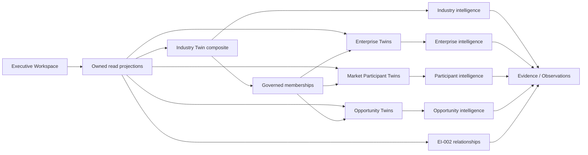
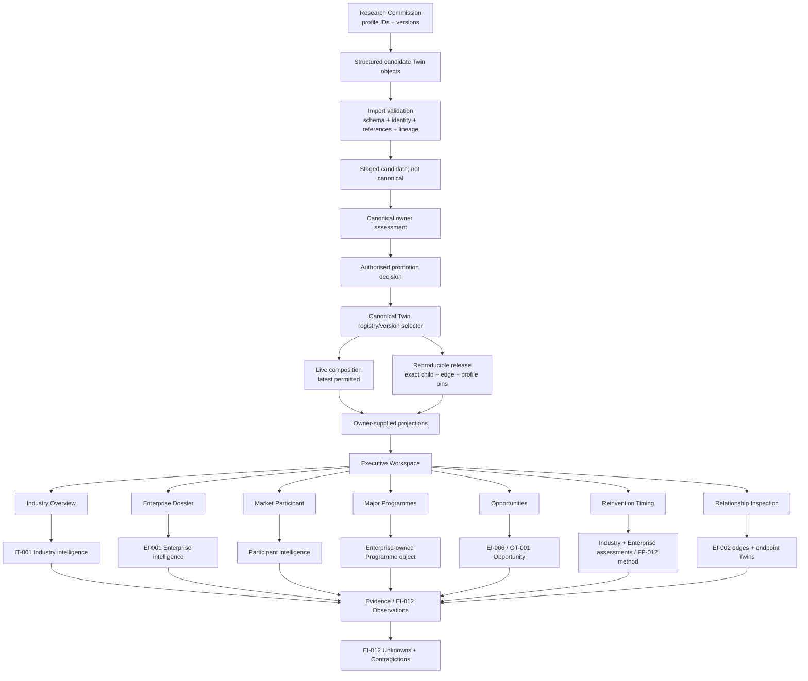

# Executive Experience to Twin Object Reconciliation

**Document class:** Architecture reconciliation and implementation-profile proposal
**Status:** Review; documentation-only; non-runtime; non-promotional
**Date:** 2026-08-02
**Owner:** CIOS / Chief Architect
**Canonical implementation owner proposed for extension:** IT-001 Industry Twin Package Content Inventory and Deficiency Contract
**Decision:** **EXTEND EXISTING IMPLEMENTATION PROFILE**
**Merge recommendation:** **MERGE** this reconciliation as Review guidance; architectural acceptance and production-pack inclusion remain separate governed decisions.

## 1. Executive decision

The missing capability is **not** a new founding doctrine, Twin taxonomy, evidence model, completeness model, or Flora-owned schema. The repository already contains the functional equivalent of an implementation profile: the **Industry Twin Package Content Inventory and Deficiency Contract**, a controlled schedule to IT-001 under the Knowledge Pack Specification. It already requires structured objects, facts, relationships, history, uncertainty, lineage, deficiencies and Flora-addressability. The **Twin Presentation Model Specification** already states the invariant that required high-fidelity content must be packaged and addressable without web reconstruction. EI-001 owns Enterprise state, EI-002 owns graph identity and relationships, EI-012 owns Observations/Unknowns/Contradictions, and the applicable Twin specification owns subject state.

The existing schedule is insufficient operationally because it does not define deterministic per-experience object profiles, composite membership semantics, live-versus-pinned child resolution, or complete release composition. The existing `twin-release-manifest.schema.json` pins only one Twin ID/version and does not represent a composite release. The smallest increment is therefore to **extend the existing IT-001 controlled schedule**, not create FP-015 or a parallel “Twin Object” architecture. Section 10 is the proposed schedule extension; all other sections explain and test it.

This reconciliation does not promote Review/Draft sources to Accepted status. The Authority Registry records IT-001, FP-013, FP-014, FEIR-001 and EIRP-001 as non-production review/proposed material. The packaged programme-state baseline dated 2026-07-21 remains authoritative for programme state; later repository runtime evidence is newer operational evidence, not a silent replacement.

### Tested invariant

> Every executive experience is a read projection of one or more governed Twin objects or owner-supplied governed assessments. Flora must not synthesize absent canonical structure. Missing, inapplicable, unknown, contradictory, stale, or ineligible material is rendered as such.

This is not new doctrine. It operationalises IT-001 section 9, the Twin Presentation Model WP1-002 note, FP-013's shell boundary and FP-014's read-composition boundary. Because FP-013/014 are proposed, production obligation must rest on accepted owners plus a separately accepted extension to the IT-001 schedule.

## 2. Authority and conflict reconciliation

| Concern | Architectural intent | Existing canonical/declared owner | Authority and implementation status | Proven gap / treatment |
|---|---|---|---|---|
| Enterprise identity and state | Durable, evidence-aware enterprise model | EI-001 | Draft architecture; named in programme baseline | Reuse; no Enterprise schema recreation. |
| Foundation semantics | Shared intelligence object semantics | EIF-001 | Repository standard; authority status must remain as registered | Reuse; no second Evidence/Unknown model. |
| Identity, graph, relationships | Typed, temporal, evidence-backed nodes/edges | EI-002 | Draft; named in programme baseline | Extend EI-002 vocabulary only for genuinely absent relationships. |
| Observations and uncertainty | Evidence-linked Observations, Unknowns, Contradictions | EI-012 | Named canonical owner by reference architecture/programme baseline | Attach records by affected object/Twin IDs; do not embed substitutes. |
| Industry content/completeness | Comparative Industry Twin and 22 independent dimensions | IT-001 plus High-Fidelity Completeness Contract and controlled schedules | Review / Draft Normative; excluded from production profiles | Correct owner for proposed object-profile extension; acceptance remains required. |
| Knowledge exchange | Versioned, immutable, validated pack envelope | FP-010/FP-011, ADR-016, Knowledge Pack Specification | ADR-016 accepted; specs draft normative | Extend companion content schedule and manifest schema, not envelope doctrine. |
| Presentation | Versioned governed interpretation, not canonical fact | Twin Presentation Model Specification | Draft Normative | Reuse for audience/purpose/projection metadata; never use it to fill canonical state. |
| Twin lifecycle | Refresh, supersession, promotion separation | Industry Twin Lifecycle Specification and subject owner | Draft Normative | Add child selection and release rules to schedule/schema. |
| Opportunity | Individual opportunity state | EI-006, with OT-001 Review interface | EI-006 owner; OT-001 Review | Reuse; do not let industry themes become opportunities. |
| Market Participant | Participant state, account-relative assessment elsewhere | Market Participant Twin Specification; EI-002 | Draft Normative | Reuse stable `participant_twin_id`; contextual roles stay on relationships/assessments. |
| Reinvention | Assessment method and recommendation guardrails | FP-012 | Review, non-production | Reference only; do not create a score. |
| Workspace/mission composition | Read composition and common inspection shell | FP-013/FP-014 | Proposed, non-production | Treat as target intent and newer evidence; not production authority. |
| Runtime | Validate, resolve, render and inspect; never promote by rendering | FEIR-001/EIRP-001 under ADR-014/024 | specifications proposed; ADRs govern boundary | Current semantic adapter reconstructs presentation structures from staged candidates. |
| Programme state | Current accepted delivery baseline | `CURRENT-PROGRAMME-STATE.md` | Programme-state baseline, 2026-07-21 | It says WP-011 is runtime baseline. Later WP2/runtime artifacts are operational evidence only. |

**Pack/repository conflict.** The Researcher Knowledge Pack does prescribe registers, templates and a structured operating route, and explicitly says narrative alone is insufficient. It does not carry executable object schemas for every output. Newer IT-001 package-inventory amendments require richer structured/addressable contents but remain Review and absent from the production Researcher profile. Do not silently treat those amendments as packaged instructions: acceptance, registry membership, pack rebuild and checksum validation are required.

## 2.1 Inspected authority index

The conclusions above were traced to the following repository sources (paths are relative to the repository root):

* `architecture/reference-architecture/CIOS-Reference-Architecture-v1.0.md` and `architecture/reference-architecture/Architecture-Authority-Registry.md`;
* `architecture/enterprise-intelligence/volume-1-enterprise-modelling/EI-001-Enterprise-Model-Specification.md`, `EI-002-Enterprise-Knowledge-Graph.md`, EI-003, EI-004 and `architecture/reference-architecture/standards/EIF-001-Enterprise-Intelligence-Foundation-Model.md`;
* `architecture/specifications/industry-twins/IT-001-Industry-Twin-Specification.md`, `High-Fidelity-Twin-Completeness-Contract.md`, `Industry-Twin-Lifecycle-Specification-v1.0.md` and their controlled schedules;
* FP-009, FP-012, FP-013, FP-014, FEIR-001, EIRP-001, ADR-014 and ADR-024;
* `architecture/specifications/knowledge-packs/Knowledge-Pack-Specification-v1.0.md`, `Industry-Twin-Package-Content-Inventory-Contract.md`, `twin-release-manifest.schema.json` and the Twin Presentation Model specification;
* the current `knowledge-packs/researcher/` pack, its manifest, RG-001, output templates and the current Chief Architect `CURRENT-PROGRAMME-STATE.md`; and
* Flora blueprint-import manifest, adapter, semantic-Twin, assessment, research-requirement, promotion and Executive Workspace modules, together with their runtime acceptance reports and tests.

No artefact titled Object Specification, Object Profile, Twin Profile, Twin Schema, Construction Profile, Implementation Profile, Digital Twin Profile, Knowledge Pack Profile, Information Contract, Completeness Schedule, Release Schedule, Import Contract, Research Contract, Twin Membership Model, Composite Twin, Twin Composition, Child/Nested Twin, Twin Catalogue or Twin Registry was assumed absent by name alone. The functional comparison found the controlled package-content schedule to be the closest existing implementation profile, the Presentation Model to be a view contract only, the release manifest to be an incomplete exchange schema, and the runtime registry to be an implementation store rather than canonical information ownership.

## 3. Repository discovery report

| Concept | Repository location | Document/code owner | Status | Scope/current use | Potential relevance | Gap |
|---|---|---|---|---|---|---|
| Twin types/ownership | `EI-001-Enterprise-Model-Specification.md` phase 3 | EI-001 | Draft normative extension | Enterprise, Industry, Participant, Opportunity, Relational definitions | Stable subject owners | No executable composite profile. |
| Industry Twin | `IT-001-Industry-Twin-Specification.md` | IT-001 | Review | Comparative durable model; Enterprise population and containment modes | Composite semantics already partly present | Participant/opportunity/relational membership and release resolution incomplete. |
| Enterprise identity | EI-001; EI-002 | EI-001/EI-002 | Draft | Stable graph entity and canonical Enterprise state | Child identity continuity | Runtime imports may derive IDs from rows. |
| Participant identity | `Market-Participant-Twin-Specification-v1.0.md` | Participant specification | Draft Normative | Stable `participant_twin_id`, lifecycle/version | Independent participant child | No composite membership record. |
| Opportunity identity | `OT-001-Opportunity-Twin-Specification.md` | EI-006 via OT-001 | Review | Governed opportunity interface | Independent opportunity child | Not in current composite manifest. |
| Programme | EI-001 transformation portfolio; EI-002 Programme entity | Enterprise owner / EI-002 graph | Draft | Enterprise-owned governed object with graph identity | Projection and possible promotion | No canonical Programme Twin type; remain objects unless promotion is separately approved. |
| Relationships | EI-002 | EI-002 | Draft | Typed, directed, temporal, evidenced graph records | Reuse for membership and cross-Twin edges | Several requested verbs/types absent or semantically different. |
| Content profile | `Industry-Twin-Package-Content-Inventory-Contract.md` | IT-001 controlled schedule | Draft Normative proposal | Logical structured object inventories and deficiencies | Equivalent implementation-profile artefact | Per-experience fields, membership and composition are incomplete. |
| Completeness | IT-001 High-Fidelity Contract and schedules | IT-001 | Review/proposed | 22 separate dimensions, deficiencies, promotion gates | Completeness authority | Must not be replaced by readiness score. |
| Pack envelope | `Knowledge-Pack-Specification-v1.0.md` | FP-010/011, ADR-016 | Draft Normative under accepted ADR | Manifest, selection, validation, immutable release | Exchange contract | Generic `MANIFEST.yaml` versus release `manifest.json` conventions require reconciliation. |
| Release manifest | `twin-release-manifest.schema.json` | Knowledge Pack specification | Schema v1.0 | Single Twin/version release and payload paths | Extension point | No child/membership/relationship/profile snapshot pins or rollback. |
| Presentation model | `Twin-Presentation-Model-Specification-v1.0.md` | FP-011/ADR-016 | Draft Normative | Audience-specific versioned interpretation | Projection metadata and no-reconstruction invariant | It cannot own canonical object shapes. |
| Lifecycle/versioning | Industry Twin Lifecycle Specification; package spec | Twin lifecycle / Knowledge Pack | Draft Normative | Refresh, supersession, immutable historical packs | Independent upgrade basis | No live resolver or parent impact contract. |
| Import | `blueprint_import/manifest.py`, `cios_twin_adapter.py`, `semantic_twin.py` | Flora runtime | Implemented, bounded | Structural manifest and staged semantic adaptation | Current enforcement surface | Validates/adapts package records, not all business-subject profiles. |
| Executive projections | `blueprint_import/executive_workspace.py` | Flora runtime | Implemented pilot/bounded | Workspace, explorer, dossier, gaps, diagnostics | Shows present reconstruction points | Derives collections, readiness facades, opportunity cards and prose from generic semantic objects. |
| Assessment/gaps | `research_requirements.py`, Executive Assessment projection in semantic adapter | Canonical owner projection consumed by Flora | Implemented bounded | Owner-labelled assessment and generated requirements | Correct projection boundary | Inputs still depend on generic candidate shapes. |
| Research outputs | `knowledge-packs/researcher/` guides/templates | Researcher profile | Packaged baseline | Markdown tables/registers plus handover | Strong process and topics | No machine-readable object-profile suite; free-form cells remain possible. |
| Registry | blueprint import registry/staging; runtime Twin pages | Flora implementation | Operational store, not architecture registry | Package/run lookup | Partial lookup | No demonstrated canonical, type-wide, version-aware Twin Registry. |

### Discovery answers

1. **Industry composite?** Partially yes. IT-001 defines a higher-order comparative Twin with an Enterprise Population and four containment/reference modes; it does not yet specify a complete governed composite across every requested child category.
2. **Enterprise references?** Yes, including identity/version-preserving embedded releases, snapshots, projections and external dependencies.
3. **Market Participant references?** Content and graph participation are required, but a version-resolved child-membership contract is absent.
4. **Opportunity references?** Industry themes link toward separately owned Opportunity Twins; composite child membership is not specified.
5. **Relational Twin references?** EI-001 defines Relational Twin semantics and EI-002 owns cross-Twin edges; an Industry release member contract is absent.
6. **Programmes?** Canonical governed objects within the Enterprise Model and EI-002 graph. No inspected authority establishes Programme Twin as a canonical type. They are promotable only after a separate owner/architecture decision.
7. **Membership register?** No independent register was found. Reuse an EI-002 typed relationship profile rather than create a parallel store.
8. **Ownership vs membership?** Explicit for Enterprise containment in IT-001; incomplete for other child types.
9. **Many-to-many?** EI-002 graph permits it structurally; no parent-scoped membership profile or resolver contract proves it operationally.
10. **Pinned versions?** Enterprise embedded modes require source versions, but the release schema has no resolved child array.
11. **Import identity?** Stable IDs are required and some adapters preserve original IDs; fallback/derived row IDs mean preservation is not universally enforced.
12. **Independent child upgrade?** Architecturally consistent with ownership and immutable releases, but no implemented resolver/event contract proves it.
13. **Canonical Flora resolution?** Not demonstrated. Current workspace assembles a `SemanticTwin` from candidates for one import run.
14. **Rendering source?** A mixture: owner-labelled projections exist, while presentation-only structures are built from generic semantic candidates.
15. **Runtime reconstruction?** `assemble_semantic_twin`, `business_collections`, `_narrative`, `_opportunity_card`, `_reinvention_themes`, `_dossier`, and legacy assessment inventory logic infer sections/labels from generic kinds/fields.
16. **Research pack exact objects?** It names outputs, required registers and detailed topic requirements, with some templates, but not executable object contracts for all experiences.
17. **Package explicit objects?** Newer content schedule requires explicit structured objects; generic pack spec permits compatible assets and the packaged research templates remain prose/table oriented.
18. **Import completeness?** Structural/candidate validation and bounded semantics are implemented; full IT-001 business-subject completeness is not demonstrably enforced.
19. **Child uncertainty?** EI-012 semantics allow affected object references; package inventory requires affected objects. Composite child attachment/resolution needs explicit validation.
20. **Cross-Twin relationships?** Yes in EI-002 as governed relationship objects, but requested vocabulary and runtime resolution are incomplete.

The stop condition is satisfied: identity (EI-001/EI-002 and subject specs), membership/relationships (EI-002, with IT-001 owning inclusion decisions), and versioning (subject lifecycle plus Knowledge Pack release) have identifiable owners. The gap is executable integration, not missing ownership.

## 4. Executive Experience → Twin Object reconciliation matrix

Routes below are current bounded routes/renderers, not claims of system-wide capability. `/:run` abbreviates `/blueprint-import/{import_run_id}`.

| Executive experience | Current route/renderer and runtime projection | Canonical Twin/object and information owner | Completeness / Evidence / Relationship owner | Research source | Current gap and required change | New artefact? |
|---|---|---|---|---|---|---|
| Twin Map | `/:run`; `_twin_map`, `business_collections` | Industry Twin composition; IT-001 plus member owners | IT-001 / EI-012 / EI-002 | scope, populations, relationships | Generic-kind grouping reconstructs composition. Consume membership/relationship projection. | No—extend schedule. |
| Industry Overview | `/:run/aspect?collection=industry-overview`; `_aspect_page` | Industry Twin; IT-001 | IT-001 / EI-012 / EI-002 | Industry Research Pack | No deterministic section object. Add Industry Overview profile referencing IT-001 sections. | No. |
| Enterprises directory | `/:run/aspect?collection=enterprises`; `_enterprise_index` | Enterprise Twin identities; EI-001 | IT-001 roll-up only / EI-012 / EI-002 | Enterprise Intelligence Packs | Candidate-derived list lacks membership/version resolution. | No. |
| Enterprise Dossier | `/:run/enterprise/{id}` concept via `view=enterprise`; `_dossier` | Enterprise Twin; EI-001 | EI-001/EIF-001 / EI-012 / EI-002 | Enterprise Intelligence Pack | Runtime formats generic attributes. Require owner-supplied dossier projection over canonical ID/version. | No. |
| Market Participants | `/:run/aspect?collection=market-participants` | Market Participant Twin | participant spec / EI-012 / EI-002 | participant template | Classification is inferred from object kind. Resolve participant membership and owned projection. | No. |
| Major Programmes | `/:run/aspect?collection=major-programmes` | Enterprise-owned Programme object; EI-001, graph in EI-002 | EI-001/IT-001 applicability / EI-012 / EI-002 | Programme Catalogue | No Programme Twin authority; generic programme records. Add object profile, not Twin type. | No. |
| Opportunities | `/:run/aspect?collection=opportunities`; `_opportunities`, `_opportunity_card` | Opportunity Twin; EI-006/OT-001 | opportunity owner / EI-012 / EI-002 | Opportunity Hypothesis template | Cards search aliases and create missing labels at render time. Require projection fields/status explicitly. | No. |
| Procurement intelligence | Enterprise dossier and explorer; `_procurement_item` | Enterprise Procurement/Contract objects; EI-001/EI-002 | EI-001 and IT-001 deficiency HFT-PRC / EI-012 / EI-002 | Procurement Catalogue | No deterministic procurement projection contract. | No. |
| Reinvention Timing | `/:run/aspect?collection=reinvention-timing`; `_reinvention_themes` | Industry/Enterprise assessment objects; FP-012 method, subject owner state | Existing assessment/completeness owners / EI-012 / EI-002 | research assessment inputs | Runtime classifies kinds/keywords. Consume versioned owner assessment projection; do not rescore. | No. |
| Evidence | explorer/inspection links and `/live` product | Evidence objects; existing Evidence/Observation owners | EI-012 and source standards / EI-002 links | Evidence inventories | Multiple bounded stores; child/object attachment must resolve. | No. |
| Relationships | explorer/advanced inspection | EI-002 relationship object / Relational Twin when separately governed | applicable owner / EI-012 / EI-002 | relationship catalogue | Current semantic workspace does not prove canonical cross-Twin graph resolution. | No. |
| Unknowns | explorer/gaps/inspection | EI-012 Unknown | subject completeness / EI-012 / EI-002 affected links | Unknown register | Must bind independent child and relationship IDs/versions. | No. |
| Contradictions | explorer/gaps/inspection | EI-012 Contradiction | subject completeness / EI-012 / EI-002 affected links | Contradiction register | Same; no convenient narrative flattening. | No. |
| Research Gaps | `/:run/health`; `_research_gaps`, `research_requirements` | Derived owner-assessment projection, not Twin truth | IT-001/subject owner / EI-012 / EI-002 | deficiencies and backlog | Bounded derivation exists; membership-specific gaps and refresh after child upgrade are absent. | No. |
| Research Commission | `export_research_gap_brief` plus validation | Governed commission object/workflow; gaps remain owner outputs | applicable completeness owner / evidence owners | generated brief from requirements | Markdown commission is deterministic but does not require machine-readable result objects. Bind commission to profile IDs/versions. | No. |
| Advanced Inspection | `/:run/diagnostics`; `_advanced_diagnostics` and explorer | Source objects from every owner | each owner / EI-012 / EI-002 | complete candidate package | Must expose canonical IDs, source versions and unmodified payloads; generic adapter is incomplete. | No. |

## 5. Composite Industry Twin model

An Industry Twin is a governed composite in the implementation sense: IT-001 owns industry identity, boundary, economics, structure, pressures, transformation mechanisms, industry-level reinvention assessment, inclusion decisions, comparative/cross-member projections, and its release composition. “Composite” does not make child state Industry-owned.

| Category | Classification | Owner and composition rule |
|---|---|---|
| Enterprise | Independent Twin | EI-001 owner; referenced by canonical identity through an EI-002 membership edge; release may embed immutable governed state using IT-001's four modes. |
| Market Participant | Independent Twin when structurally significant/reusable; otherwise governed actor object | Participant owner; contextual parent role is on membership/assessment, never participant-global truth. |
| Opportunity | Independent Twin once EI-006/OT-001 identity/lifecycle applies | Opportunity owner; Industry Twin owns themes only. |
| Relational | Independent Twin only where EI-001 Relational Twin lifecycle is warranted | EI-002 always owns the underlying governed edge semantics; do not duplicate edges in parent. |
| Programme | Governed Enterprise object, promotable subject | Enterprise owns state; EI-002 owns graph identity/edges. No canonical Programme Twin was found. |
| Reinvention assessment | Versioned governed assessment/projection | Subject state remains with Industry/Enterprise; FP-012 supplies Review method. It is not a child Twin by default. |
| Evidence | Governed embedded/referenced object | Existing Evidence/Observation authority; attach to claims/edges/subjects. |
| Unknown / Contradiction | Governed embedded/referenced uncertainty object | EI-012; independently attachable to child, membership, edge or release. |
| Membership | EI-002 typed relationship profile | Industry owner decides inclusion; EI-002 owns relationship semantics. |
| Directories, dossiers, tiles and timing views | Presentation projections | Never canonical subject state. |

### Ownership versus membership

| Owner | Owns | Does not own merely through membership |
|---|---|---|
| Industry | scope, industry facts/economics/structure/pressures/mechanisms, membership decisions, comparisons, release manifest, roll-up projections | enterprise strategy/financials; participant capabilities; opportunity state; child evidence or child completeness |
| Enterprise | identity, purpose, strategy, units, financial/operating/technology state, ecosystem, risks, programme/procurement objects, enterprise opportunities and assessment inputs | Industry inclusion rationale; account-relative participant truth |
| Participant | identity, roles/capabilities/offers, relationships, significance, delivery evidence, constraints | Parent-specific inclusion/competitive/partner role unless contextual relationship/assessment owns it |
| Opportunity | customer, problem, buying context, value, timing, stage, competition, partners, evidence and uncertainty | Industry opportunity theme or supplier recommendation |
| EI-002 / Relational owner | source, target, type, direction, timing, evidence, uncertainty and lifecycle | Endpoint Twin state |
| Programme owner | Enterprise Twin for programme object state; EI-002 for links | No Programme Twin lifecycle until separately governed |

## 6. Membership relationship profile

Do **not** create a second membership store. Add a controlled `HAS_MEMBER` relationship profile to EI-002 (EI-002 currently has `Industry CONTAINS Participant`; use `HAS_MEMBER` as the general composite relationship and retain `CONTAINS` as a compatibility alias only if governance approves equivalence). Industry owns the inclusion decision; EI-002 owns record semantics.

| Required field | Binding |
|---|---|
| `relationship_id` (membership ID) | Stable EI-002 edge ID. |
| `source_twin_id` (`parent_twin_id`) | Canonical composite Industry Twin ID. |
| `target_twin_id` (`member_twin_id`) | Canonical child ID; never a copied payload ID. |
| `target_twin_type` | Controlled existing Twin type. |
| `relationship_type` | Canonical `HAS_MEMBER` (pending EI-002 vocabulary approval). |
| `membership_role` | Parent-context role, not child-global type. |
| `rationale` | Why inclusion is material. |
| `domain` | Optional subsector/domain in parent context. |
| `effective_from`, `effective_to` | Effective interval; open end allowed. |
| `lifecycle_state` | candidate, active, suspended, ended, superseded, rejected/quarantined consistent with owner vocabulary. |
| `evidence_refs`, `confidence` | EI-002 lineage and governed confidence. |
| `unknown_refs`, `contradiction_refs` | EI-012 object references affecting membership. |
| `canonical_owner` | Industry owner/function accountable for inclusion. |
| `source_version`, `last_reviewed_at` | Relationship version and review date. |
| `resolution_policy` | `latest_permitted` for live composition or `pinned` in release. |
| `resolved_member_version` | Mandatory in reproducible releases; forbidden as mutable membership truth for live composition. |

Cardinality is many-to-many. A canonical Google Cloud participant or BBC Enterprise has one identity and separate parent-scoped membership edges, each with its own rationale, role, interval, evidence and uncertainty. Parent-specific claims belong on the edge or a governed contextual assessment.

## 7. Cross-Twin relationship reconciliation

Existing terms are reused exactly where semantics match. `HAS_MEMBER`, `OWNS`, `ENABLES`, `CREATES`, direct `TARGETS Enterprise/Business Unit`, participant-to-enterprise `PARTNERS_WITH`, Participant-to-Participant `COMPETES_WITH`, `Regulation IMPACTS`, and `Technology ENABLES Programme` are **gaps** requiring EI-002 review; runtime-local aliases are prohibited.

| Requested semantic | Canonical term / disposition | Owner | Source → target | Time/evidence/uncertainty | Projection use |
|---|---|---|---|---|---|
| Industry member | `Industry CONTAINS Participant` exists; propose general `Industry HAS_MEMBER Twin` | EI-002; inclusion by Industry | Industry → child Twin | Effective interval, evidence; EI-012 refs | map/directories/resolution |
| Enterprise owns Programme | Closest existing: `Executive OWNS Programme`; DWP example uses `HAS_PROGRAMME`. **Gap:** approve `Enterprise HAS_PROGRAMME Programme`, not `OWNS` | EI-002; Enterprise state EI-001 | Enterprise → Programme | EI-002 standard | programmes/dossier |
| Programme creates/enables Opportunity | No exact canonical term; propose EI-002 extension only after semantics review | EI-002 | Programme → Opportunity | Evidence or labelled inference; uncertainty refs | opportunity lineage |
| Opportunity targets Enterprise/BU | Existing `Recommendation TARGETS Executive`, not equivalent. Propose explicit EI-002 terms | EI-002/EI-006 | Opportunity → Enterprise/BU | Required evidence and timing | opportunity card |
| Participant supplies Enterprise | `Participant SUPPLIES Enterprise` | EI-002 | Participant → Enterprise | Standard edge governance | supplier/account views |
| Participant partners with Enterprise | `PARTNERS_WITH` exists Participant→Participant only. Extend endpoint constraint if validated | EI-002 | Participant → Enterprise | Standard | ecosystem |
| Participant competes with Participant | Existing model represents role but no term. Add only through EI-002 vocabulary review | EI-002 | Participant ↔ Participant | Symmetry/effective context explicit | competitive view |
| Participant competes for Opportunity | `Participant COMPETES_FOR Opportunity` | EI-002 | Participant → Opportunity | Standard | opportunity context |
| Regulation impacts Enterprise | Existing `Regulator PRESSURES Enterprise`; use when actor pressure is intended. `Regulation IMPACTS` is a gap | EI-002 | Regulator/Regulation → Enterprise | Evidence, jurisdiction, interval | pressure/regulation |
| Industry Pressure affects Enterprise | `Industry PRESSURE AFFECTS Enterprise` | EI-002 | Pressure → Enterprise | Standard | overview/dossier |
| Technology enables Programme | Existing inverse-ish `Programme MODERNISES Technology Platform`; not equivalent. Gap | EI-002 | Technology → Programme | Evidence/inference labelled | programme dependencies |
| Evidence supports Claim | Existing terms support Signal and contradict Hypothesis. General Claim endpoint is not defined; reuse typed reasoning chain or extend EI-002 deliberately | EI-002/EI-012 | Evidence → governed reasoning object | Mandatory evidence ID | inspection |
| Evidence contradicts Claim | `Evidence CONTRADICTS Hypothesis`; generalisation requires EI-002 review | EI-002/EI-012 | Evidence → governed reasoning object | Contradiction retained | inspection |

Every accepted edge carries stable ID, typed/directed resolvable endpoints, producer, evidence/Observation lineage, confidence, freshness, effective interval, lifecycle/validation status and EI-012 Unknown/Contradiction references. Absent expected edges create IT-001 deficiencies, never fabricated edges.

## 8. Twin Object Catalogue extension

This is a catalogue of bindings, not duplicate schemas. Identifiers are descriptive slugs pending repository naming-governance approval; they are not new architecture IDs.

| Profile | Canonical owner / Twin | Purpose and experiences | Persistence / lifecycle / version / promotion | Mandatory relations | Completeness / existing schema | Missing detail |
|---|---|---|---|---|---|---|
| `industry-overview` | IT-001 / Industry | Overview, map | derived projection; no independent lifecycle; versioned profile; not promotable | Industry objects→Evidence | IT-001 schedules | deterministic sections/locator |
| `enterprise-dossier` | EI-001 / Enterprise | directory, dossier, procurement | derived projection; no; versioned; no | Enterprise membership and EI-002 links | EI-001 | projection selection contract |
| `market-participant` | participant spec / Participant | participant pages | persisted Twin; independent; versioned/promotable by owner | membership, account edges | participant spec | composite resolver |
| `programme` | EI-001 / Enterprise | programmes | persisted object; dependent by default; versioned with Enterprise; promotable to Twin only by future decision | Enterprise HAS_PROGRAMME (gap), evidence | EI-001/EI-002 | exact output/import profile |
| `opportunity` | EI-006/OT-001 / Opportunity | opportunities | persisted Twin once governed; independent; versioned/promotable | target/programme/participant edges | OT-001 Review | accepted executable schema |
| `procurement` | EI-001/EI-002 / Enterprise | procurement | persisted object; dependent; versioned; not Twin-promotable by default | buyer, contract, supplier, evidence | EI-001/EI-002 | exact output/import profile |
| `reinvention-assessment` | subject owner + FP-012 method | timing | persisted assessment or owner projection; assessment lifecycle; versioned; promotion by owner | assessment→subject/evidence | FP-012 Review | accepted contract/status vocabulary |
| `relationship` | EI-002 / endpoints | relationships/map | persisted edge; independent lifecycle; versioned/promotable per graph owner | source/target/evidence | EI-002 | missing vocabulary above |
| `evidence` | existing Evidence/EI-012 owner | all inspection | persisted; independent; versioned; governed acceptance | supports/contradicts typed objects | existing model | no duplicate |
| `unknown` / `contradiction` | EI-012 | gaps/inspection | persisted; independent review lifecycle; versioned | affects object/edge/assessment | EI-012 | composite attachment validation |
| `membership` | EI-002 + Industry inclusion owner | map/directories/releases | persisted edge; independent lifecycle/version; promoted by inclusion owner | parent/child/evidence | EI-002 | general profile fields |
| `industry-release-manifest` | Knowledge Pack + IT-001 | reproducible release | persisted immutable release; independent/versioned; release approval | pins members/edges/profiles/snapshots | manifest schema v1.0 | composition arrays and rollback |

## 9. Object-profile contract template

Each profile entry added to the IT-001 schedule must contain these 23 bindings; `reference` means the schedule points to the owner rather than copying its rules.

1. **Purpose** and decision supported.
2. **Canonical owner** (document and governance function).
3. **Executive experience(s)** served.
4. **Object identity** and stable ID scheme reference.
5. **Applicability** predicate and materiality basis.
6. **Mandatory sections** (owner paths, not presentation headings alone).
7. **Mandatory fields** with type/cardinality/owner path.
8. **Conditional fields** and machine-testable conditions.
9. **Not applicable**: explicit reason, assessor, date and evidence/basis; never blank-as-NA.
10. **Relationships**: EI-002 terms, endpoint types and direction.
11. **Evidence**: owner rule, references and minimum lineage.
12. **Freshness**: owner thresholds/triggers, never profile-invented scoring.
13. **Unknowns**: EI-012 references and affected fields/decisions.
14. **Contradictions**: EI-012 references, sides and impact.
15. **Lifecycle** states/owner.
16. **Versioning** and supersession.
17. **Completeness authority** reference.
18. **Eligibility authority** reference.
19. **Promotion authority** and separation from package validity.
20. **Import validation**: schema, referential, semantic and profile checks.
21. **Research output**: required machine-readable object collection/profile version.
22. **Runtime projection**: input locator and allowed deterministic formatting only.
23. **Acceptance criteria** with executable assertions and governed human decisions.

The profile owns only the binding. It does not own doctrine, evidence truth, reasoning, completeness rules, eligibility or promotion.

### Minimum executable acceptance rules

* Every applicable required field is present or linked to an explicit Unknown; `not_applicable` includes rationale.
* Every object has canonical/stable candidate identity, type, owner, lifecycle state, version/source version and evidence cut-off.
* Every material claim/edge resolves evidence/Observation lineage or is explicitly inferred/human-supplied/unknown.
* Every relationship resolves typed endpoints; every membership resolves parent and child canonical IDs.
* Contradictions are retained; missing evidence cannot be converted into prose.
* Import rejects unknown profile versions, dangling endpoints, duplicate identities and absent required inventories; it quarantines rather than promotes.
* A renderer may order, filter, summarise and label owned values but cannot manufacture a missing canonical field or eligibility result.

## 10. Proposed canonical extension to the existing controlled schedule

Amend `architecture/specifications/knowledge-packs/Industry-Twin-Package-Content-Inventory-Contract.md`—after architectural acceptance—to add:

1. the catalogue and 23-point profile template in sections 8–9;
2. normative profiles for membership, Industry Overview binding, Enterprise Dossier binding, Programme object, Procurement object and Industry Release Manifest;
3. references (not copies) for Participant, Opportunity, Relationship, Evidence, Unknown, Contradiction and Reinvention owners;
4. import validation classes: envelope, profile/schema, stable identity, referential integrity, semantic applicability, lineage/uncertainty, completeness-owner output presence and release-pin integrity;
5. research commissions identifying required `profile_id`, `profile_version`, object count/applicability expectations and acceptance assertions;
6. runtime rule: projections consume profile-conformant objects/owner assessments and surface missing/unsupported states.

The manifest schema then receives a backward-incompatible major-version extension (or a new versioned schema alongside v1.0; never mutate released v1.0 semantics) described in section 12. EI-002 receives only the vocabulary additions approved from section 7. Researcher pack changes follow acceptance and registry inclusion; they must not precede authority.

## 11. Independent child lifecycle and many-to-many resolution

### BT upgrade without rebuilding the UK Telecommunications Twin

1. Research emits a candidate Enterprise object set with canonical BT `twin_id`, new candidate version, prior-version lineage and profile versions.
2. Import validates profile shape, ID continuity, relationships, evidence, uncertainty and Enterprise requirements; candidate state remains quarantined/staged from canonical state.
3. Enterprise owner assessment applies EI-001/EIF-001 and applicable completeness rules. Package validity is not promotion.
4. Authorised promotion records the permitted BT version, supersedes the prior permitted version without deleting it, and retains evidence lineage/audit decision.
5. Industry membership remains an EI-002 edge to BT identity with `latest_permitted` live resolution; no parent mutation is required.
6. A resolver event (`twin_version_promoted`, with Twin ID/version and affected relationship IDs) invalidates derived caches and queues owner-supplied assessment, gap and projection refreshes. Event naming is an implementation recommendation, not new durable truth.
7. Live Telecommunications and any other authorised parent resolve the new permitted version under access/effective-time rules.
8. Historical Industry releases continue resolving their exact pinned BT version and snapshot references.
9. Rollback changes the permitted live selector through an authorised decision, never edits history; a corrective Industry release is required only when a published reproducible composition must change.
10. Supersession links old/new child versions, promotion decision, evidence cut-offs and profile versions end-to-end.

A parent's industry-level synthesis may become stale when a material child changes. The event creates a refresh obligation/Unknown; it does not silently rewrite the parent conclusion. Parent release manifests remain immutable.

## 12. Industry release manifest profile

### Live composition

A mutable resolver view, not a released historical asset: Industry Twin ID plus membership-set selector, effective time, access scope and policy `latest_permitted`. It resolves each member at read time and records the resolution trace. It is never labelled reproducible unless materialised as a release.

### Reproducible release

A new manifest schema version must require:

| Field | Rule |
|---|---|
| `release_id`, `industry_twin_id`, `release_version`, `released_at`, `governance_state` | Stable release identity and approval state. |
| `resolved_members[]` | Canonical child Twin ID/type and exact child version; content mode, checksum/snapshot locator and effective date. |
| `membership_set_version`, `memberships[]` | Exact relationship IDs and versions used. |
| `relationship_set_version` | Exact graph snapshot/version plus checksum/locator. |
| `profile_versions[]` | Every applied profile ID/version. |
| `evidence_snapshot_ref` | Immutable evidence snapshot/selection reference. |
| `unknown_snapshot_refs[]`, `contradiction_snapshot_refs[]` | Immutable uncertainty selection references. |
| `completeness_projection_version` | Owner-produced projection version; not a score. |
| `release_notes` | Material changes/limitations. |
| `supersedes`, `rollback_reference` | Prior release and approved recovery target. |

Validation proves every pin resolves, checksums match, membership was effective at release time, endpoint versions exist, profiles are known, and snapshot access/lineage is preserved. Current schema v1.0 lacks these fields and remains valid for releases made under v1.0.

## 13. Coverage projections (never one readiness score)

The Industry Twin may aggregate, but not reassess, child owner outputs:

| Projection | Numerator / denominator | Owner input | Example |
|---|---|---|---|
| Population coverage | represented material members / declared material population | Industry scope/membership decisions | 14/14 material enterprises represented |
| Intelligence depth | children with required owner assessment state / represented applicable children | child completeness owner outputs | 3/14 owner-assessed |
| Evidence coverage | children meeting declared current primary-evidence predicate / applicable children | Evidence and completeness owner outputs | 10/14 with current primary evidence |
| Temporal coverage | children refreshed inside owner threshold / applicable children | child freshness outputs | 6/14 in period |

Each projection declares population, applicability, effective time, child assessment versions, Unknowns and exclusions. They are separate values; no average or traffic-light combination is permitted.

## 14. Embedded object versus independent Twin promotion test

An object stays embedded when it is single-use, weakly identified, immature, dependent on its owner lifecycle, not independently assessed/versioned/researched, and not reused. Promote only when a stable identity, independent owner/lifecycle/completeness/research/version/promotion, repeated reuse, multiple parents, rich relationships or separate evidence lineage is materially required. Promotion is an owner/governance decision, not a researcher or runtime inference.

| Subject | Default now | Promotion trigger |
|---|---|---|
| Programme | Enterprise-owned EI-001/EI-002 object | Repeated cross-enterprise reuse and independently governed lifecycle justify a future canonical owner/type decision. |
| Opportunity | Independent Opportunity Twin when EI-006/OT-001 requirements apply; immature hypothesis may remain governed object | Stable buyer/problem/lifecycle, separate promotion/evidence and reuse. |
| Market Participant | Independent Twin for structurally significant reusable participant; lightweight actor otherwise | Multiple account/industry memberships, owned capabilities and lifecycle. |
| Regulation | EI-002 governed object/relationship context | Independent lifecycle/assessment/reuse demands a separately approved owner; do not auto-create Twin. |
| Technology | EI-002 Technology Platform object | Promote only under separately governed technology subject architecture. |
| Capability | Participant/Enterprise governed object | Independent identity, reuse, evidence and governance across owners. |

## 15. Research production and import contract

```text
Architecture → canonical owners → accepted implementation profiles
→ Research Commission(profile IDs/versions and applicability)
→ structured Twin objects + EI-002 relationships + Evidence/EI-012 uncertainty
→ candidate Knowledge Pack → validation → staged import
→ owner assessment → authorised promotion decision
→ canonical registry/version resolution → Executive Workspace projection
```

The profile fixes object types, sections, fields, relationships, evidence/freshness references, Unknown/Contradiction handling and acceptance tests. Researchers supply evidence-backed facts, structured observations, applicable relationships, explicit uncertainty/applicability and source coverage. They cannot self-declare architecture compliance, promotion/recommendation eligibility or executive readiness.

A free-form report may accompany a package as a Presentation Model; it cannot satisfy the structured object requirement. Import validates envelope and checksums, known profile versions, object schema/applicability, identity continuity/collisions, edge endpoints, evidence/uncertainty references, version/supersession consistency, and required owner assessment artefacts. Import acceptance remains separate from canonical promotion.

## 16. Runtime alignment matrix

| Capability | Architectural intent | Current implementation evidence | Repository owner | Gap / required increment | Commercial outcome |
|---|---|---|---|---|---|
| Composite membership | Resolve explicit governed children without copied state | `SemanticTwin` groups candidate objects; no canonical membership resolver demonstrated | IT-001 inclusion + EI-002 edge | Membership profile, store/query and resolver | One coherent landscape |
| Child identity | Stable canonical endpoint | Original IDs often retained; adapters may derive/fallback IDs | subject owner/EI-002 | Enforce canonical identity and collision quarantine | Trustworthy drill-down |
| Version-aware resolution | Live latest permitted; releases pinned | Package/version metadata exists; child selection not shown | lifecycle/Knowledge Pack | Resolver and policy trace | Current plus reproducible views |
| Member drill-down | Navigate parent→canonical child | Enterprise dossier works within assembled import | subject owner projection | Canonical route by Twin ID/version | Reusable dossiers |
| Child assessment | Display owner assessment | `executive_assessments`/`twin_readiness` labels authority and avoids parallel scoring | completeness owner | Resolve assessments by child/version and refresh event | Honest depth |
| Cross-Twin graph | First-class EI-002 edges | Generic semantic related objects; no complete graph resolver | EI-002 | Canonical edge projection and vocabulary gaps | Explainable ecosystem |
| Membership gaps | Missing/weak inclusion becomes governed demand | Research requirements exist, not membership-specific | IT-001/EI-012 | Membership deficiency rules | Better population choices |
| Child enrichment | New candidate then governed promotion | Blueprint candidate/staging/promotion boundaries exist | child owner + ADR-012 boundary | Generalise to canonical child/version without parent rebuild | Incremental improvement |
| Release manifests | Immutable exact composition | v1.0 single Twin manifest | Knowledge Pack/IT-001 | Manifest v2 composition pins | Audit and rollback |
| Direct projections | Renderer formats owned values only | Workspace derives collections/cards/narrative from generic fields/kinds | presentation/runtime | Profile-driven projection DTOs; unsupported states | No invented structure |

No runtime code change is made in this mission.

## 17. Dependency diagrams

The repository uses Mermaid for architecture diagrams; the following preserve that format.

### Executive-friendly dependency diagram



### Detailed traceability diagram



Required experience chains are therefore direct: Workspace→Industry projection→IT-001 Industry object→Industry intelligence→Evidence; dossier→Enterprise projection→EI-001 Twin→Evidence; participant→Participant projection→Participant Twin→Evidence; programme→Programme projection→Enterprise-owned object→Evidence; opportunity→Opportunity projection→Opportunity Twin→Evidence; reinvention→assessment projection→subject assessments/FP-012 method→Evidence; relationship inspection→EI-002 projection→endpoint Twins→Evidence.

## 18. Applicability test

### TEL-001 simulation (no construction)

A UK Telecommunications Industry Twin can hold boundary/economics/structure/regulation/pressures/reinvention as Industry-owned objects; reference material telecom Enterprise Twins and significant participant Twins; retain Enterprise-owned programme objects; reference promoted Opportunity Twins; connect all through EI-002 evidence-backed relationships; and release either live or pinned composition. No Telecommunications-specific field enters the reusable profiles.

**Conclusion:** sufficient with existing-owner extensions—membership/manifest/object-profile schedule and EI-002 vocabulary gaps. No new high-level architecture is required.

| Industry | Same model works because | Domain-specific content kept outside profile |
|---|---|---|
| Banking | Enterprises, regulators, platforms, programmes, procurements, participants and opportunities use the same owner/edge pattern | prudential/conduct regulation and banking economics |
| Defence | Departments, primes, alliances, programmes and procurements resolve as governed subjects/relationships | classification, acquisition regimes and defence-specific boundaries |
| Health | Providers, commissioners, regulators, suppliers, programmes and opportunities reuse composition | clinical/regulatory domain facts |
| Energy | Operators, regulators, infrastructure suppliers and programmes reuse composition | market design, asset classes and energy regulation |

## 19. Canonical ownership decisions and exact file change set

| Addition | Canonical owner and why | Files affected | Architecture / runtime / research / operational impact |
|---|---|---|---|
| Per-experience object-profile bindings | IT-001 controlled package-content schedule: it already owns logical Industry payload semantics | amend `architecture/specifications/knowledge-packs/Industry-Twin-Package-Content-Inventory-Contract.md` after acceptance | No doctrine change / profile DTO consumption / fixed outputs / deterministic validation |
| Membership edge profile | EI-002 semantics plus IT-001 inclusion decision | amend EI-002 and controlled schedule | Vocabulary extension / graph resolver / membership output / many-to-many governance |
| Missing cross-Twin terms | EI-002, sole graph owner | amend EI-002 only after semantic review | No local edges / projections query canonical graph / researchers emit approved terms / consistent inspection |
| Composite release pins | Knowledge Pack manifest schema plus IT-001 release semantics | add versioned successor to `twin-release-manifest.schema.json`; amend schedule | Exchange evolution / resolver / package outputs / reproducibility |
| Research output binding | Researcher profile, subordinate to accepted canonical schedule | amend RG-001, commission/templates, manifest and rebuild pack only after authority/registry acceptance | None / importable objects / deterministic production / pack version bump |
| Runtime consumption | FEIR/EIRP boundary implemented in Flora | future adapter/validator/resolver files and tests; **not this mission** | None / stop reconstruction / none / direct projections |
| This evidence record | Chief Architect architecture reconciliation | create this file | Review evidence only / none / none / decision support |

**Files changed by this mission:** only `docs/architecture/Executive-Experience-to-Twin-Object-Reconciliation.md`. The rows above are the exact proposed future canonical change set; they are intentionally not modified before acceptance.

## 20. Open questions and unresolved conflicts

1. **Authority promotion:** IT-001 and the relevant specifications remain Review/Draft Normative and outside production profiles. Chief Architect governance must accept the schedule extension before runtime/research obligations.
2. **Manifest naming:** generic Knowledge Pack Specification requires `MANIFEST.yaml`; Twin release schema describes `manifest.json`. The Knowledge Pack owner must decide the versioned convention and migration path.
3. **Membership vocabulary:** decide general `HAS_MEMBER` versus typed `CONTAINS` terms and whether membership is a relationship subtype or relationship profile. This reconciliation recommends one EI-002 profile, not a separate register.
4. **Programme status:** no canonical Programme Twin owner was found. Programme remains an Enterprise-owned governed object until an independently evidenced promotion need and owner decision exist.
5. **Opportunity status:** EI-006 ownership is clear, but OT-001 remains Review; executable schema acceptance is pending.
6. **Registry/resolver:** no repository evidence proves a canonical, type-wide, version-aware Twin Registry or permitted-version resolver. This is an implementation gap, not permission for a new information owner.
7. **Freshness/completeness thresholds:** profiles must reference owner thresholds. Do not invent them in the schedule or renderer.
8. **Programme-state drift:** 2026-07-21 packaged state names WP-011 while later WP2 artifacts demonstrate bounded advances. Programme-state owner must reconcile them explicitly.

None prevents accepting this evidence-based **owner extension decision**; they do prevent claiming the target runtime or production Researcher contract is already delivered.

## 21. Acceptance proof and next sprint

| Merge gate | Proof / disposition |
|---|---|
| No duplicate doctrine | Sections 1–2 reference EI-001, EIF-001, IT-001, EI-002 and EI-012; no FP-015 or new taxonomy/model. |
| Composite behaviour | Sections 5–6 distinguish independent ownership, explicit membership and many-to-many edges. |
| Independent improvement/reproducibility | Sections 11–12 define live resolution, candidate/promotion/rollback and immutable pins. |
| Executive projection | Section 4 maps all requested experiences; sections 9 and 16 prohibit runtime synthesis. |
| Research determinism | Sections 9, 10 and 15 require profile-versioned machine-readable objects and executable validation. |
| Coverage integrity | Section 13 keeps population, depth, evidence and temporal projections separate. |
| Industry independence | Section 18 tests Telecommunications, Banking, Defence, Health and Energy without reusable domain fields. |
| Ownership | Sections 2, 5, 7 and 19 identify every owner; gaps go to existing owners. |

### Recommended next sprint (smallest increment)

A governance-and-schema sprint, not a Flora feature sprint:

1. approve/reject the IT-001 schedule as the implementation-profile owner;
2. settle EI-002 membership vocabulary and the manifest naming/version conflict;
3. add only the membership, release-manifest, Industry Overview, Enterprise Dossier, Programme and Procurement bindings to the controlled schedule;
4. publish a versioned composite manifest schema and JSON Schema fixtures;
5. add schema/referential validation tests including many-to-many membership, BT independent upgrade, pinned historical release, missing profile, dangling edge, Unknown/Contradiction attachment and narrative-only rejection;
6. only after authority acceptance, update/rebuild the Researcher Knowledge Pack and plan runtime resolver/projection work.

## 22. Final status

**EXTEND EXISTING IMPLEMENTATION PROFILE**
